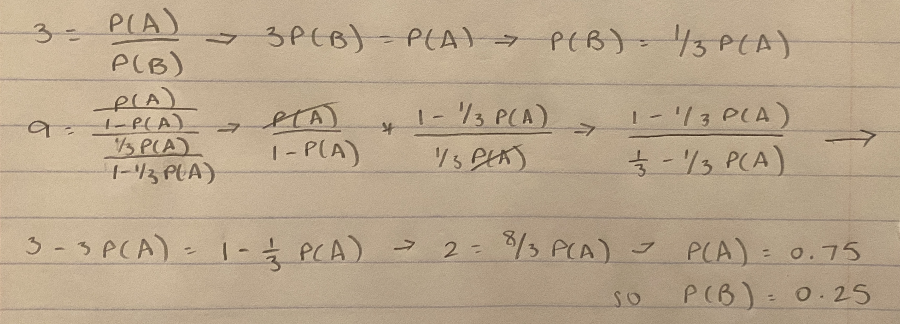

```{r setup, include = FALSE, warning = FALSE}
knitr::opts_chunk$set(echo = TRUE)
```


## Problem 1. Warm up: Log-Odds, Odds and Probability <small>5 points; 1 point each</small>

a. Convert a log-odds of 1.75 to probability.

***

```{r}
logodds_to_prob = ((exp(1))^1.75) / (1 + (exp(1))^1.75)
logodds_to_prob
```

***

b. Convert probability of 0.85 to odds.

***

```{r}
prob_to_odds = 0.85/(1 - 0.85)
prob_to_odds
```

***

c. Event A has a probability of 0.7 and the odds ratio of A to B is 1.45. Calculate the probability of event B.

***

```{r}
odds_ratio_a = 0.7 / (1 - 0.7)
odds_ratio_b = odds_ratio_a / 1.45
prob_b = odds_ratio_b / (1 + odds_ratio_b)
prob_b
```

***

d. You roll a single 6 sided die. What are the odds you get a number divisible by 3?

***

```{r}
divisible_by_three = (1/3)/(1 - 1/3)
divisible_by_three
```

***

e. The odds ratio comparing event A to B is 9 and the probability ratio is 3. What is $Pr(A)$? *Hint: let $Pr(A)=a$ and $Pr(B)=b$, and write out the odds ratio and probability ratio as equations. 

***

$Pr(A)$ = 0.75 (see work below)

```{r pressure, echo=FALSE, out.width = '100%'}

```

***


## Problem 2. Interpreting logistic regression <small>6pts; 2 pts each</small>

Suppose we collect data for a group of students in a statistics class with independent variables $X_{1}=\text{hours studied}$, $X_{2}=\text{GPA}$, and binary response variable
$$
Y= \begin{cases} 1 &\mbox{ if student received an A} \\
  0 &\mbox{ otherwise. }
  \end{cases}
$$
Suppose that we fit a logistic regression model to the data, predicting $Y$ from $X_1$ and $X_2$ (and an intercept term) and produce estimated coefficients $\hat{\beta}_{0}=-6, \hat{\beta}_{1}=0.05, \hat{\beta}_{2}=1$.

### Part a) Logistic regression and probability

According to our fitted model, what is the probability that a student receives an A if they study for $40$ hours and have a GPA of $3.5$?

```{r}
b0 = -6
b1 = 0.05
b2 = 1

a_if_study = 1/(1 + exp(-(b0 + b1*40 + b2*3.5)))
a_if_study
```

### Part b) Interpreting coefficients

According to our fitted model, an additional hour spent studying is associated with *how much* of an increase in the log odds of receiving an A?

***

An additional hour spent studying is associated with a 0.05 increase in the log odds of receiving an A.

***

### Part c) "Inverting" logistic regression probabilities

According to our fitted model, how many hours would the student in Part (a) need to study to have a $50\%$ chance of getting an A in the class?
That is, keeping GPA fixed at $3.5$, how many hours of study are needed so that the probability of an A is $50\%$?
If you aren't up for the math, feel free to find an approximate solution via guess-and-check in R.

***

```{r}
a_fifty = 1/(1 + exp(-(b0 + b1*50 + b2*3.5)))
a_fifty
```

Using guess-and-check, we have determined that when keeping GPA fixed at $3.5$, 50 hours of study are needed so that the probability of an A is $50\%$.

***


## Problem 3. Palmer Penguins Part I  <small>9pts; 3 pts each</small>

The Palmer Penguin dataset (https://allisonhorst.github.io/palmerpenguins/) consists of 344 observations of penguins belonging to 3 penguin species across the islands in the Palmer Archipeligo in Antarctica. We will build a logistic model attempting to classify the penguins based on physical characteristics. For each penguin we've recorded: 

* `species` - the species, either "Gentoo", "Adelie" or "Chinstrap"
* `island` - which of three islands the Penguin was observed (Biscoe, Dream or Torgersen)
* `bill_length_mm` - the length of the bill in mm
* `bill_depth_mm` - the depth of the bill (vertical thickness of the closed bill)
* `filler_length_mm` - length of their cute flippers
* `body_mass_g` - the body mass in grams
* `sex` - female, male or NA (unknown)
* `year` - The year of the observation: 2007, 2008 or 2009

First you need to download the library. Run this chunk of code once.
```{r, eval=FALSE, echo=FALSE}
#Run this code once to install the library
install.packages("palmerpenguins")
```

Then load the library and the penguin dataset. Note: Your RMD won't knit until you run the above chunk.
```{r}
library(palmerpenguins)
library(tidyverse)
```

### a) Adelie penguins based on island

We are going to try to classify penguins as **Adelie** or **not Adelie**. So create a new variable called `Adelie` which will be 1 or 0 based on whether the penguin species is Adelie

```{r}
penguins_ad = penguins %>%
  mutate(Adelie = as.integer(species == "Adelie")) %>%
  mutate(islandDream = as.integer(island == "Dream"))
```

Perform some analysis looking at each of the 3 islands - create a 2 way table between `island` and the `Adelie` variable. Look at the proportions conditioned on island. What proportion of observations on each island were Adelie?

```{r}
penguins_prop = penguins_ad %>%
  group_by(island) %>%
  summarize(proportion = sum(Adelie)/n())

penguins_prop
```

***

The proportion of observations on each island that were Adelie are as follows in the above table. 

***

### b) Adelie Penguins on Dream

Find the (i) probability, (ii) odds and (iii) log-odds that a randomly selected penguin from Dream is an Adelie penguin?

```{r}
adelie_odds = 0.4516129/(1 - 0.4516129)
adelie_odds

adelie_logodds = log(0.4516129/(1 - 0.4516129))
adelie_logodds
```

***

i. 0.4516129 (from table in 3a)
ii. 0.8235294
iii. -0.194156

***

### c) An island-based classifier

Now fit a logistic model predicting whether a penguin is Adelie based on island.
Interpret the intercept and the coefficient of the `islandDream` variable. Use this model to predict the probability that a penguin from Dream is Adelie.

```{r}
penguin_logistic = glm(Adelie ~ 1 + island, data = penguins_ad, family = binomial)
summary(penguin_logistic)

predict(penguin_logistic, newdata = data.frame(island = "Dream"), type = "response")
```

***

The intercept (beta_0) in this model is -1.0361 (baseline log odds for x = 0), and the coefficient (beta_1) is 0.8419 (increase in log-odds of a penguin being from Dream and Adelie when compared to the baseline). The model tells us that there is a 0.4516129 probability that a penguin from Dream is Adelie.

***


## Problem 4. Penguins Part II <small>10pts; 2 pts each</small>

In this problem we will work once again with the Palmer Penguin dataset. We will work with a subset by taking out all missing values. After you have installed the package and loaded the library, uncomment the line below.
```{r}
penguins.complete <- penguins[complete.cases(penguins),]

penguins_complete = penguins.complete %>%
  mutate(Adelie = as.integer(species == "Adelie")) %>%
  mutate(Chinstrap = as.integer(species == "Chinstrap")) %>%
  mutate(islandDream = as.integer(island == "Dream"))
```

### a) Predicting Palmer Penguins with quantitative Predictors

Now use the two bill measurements (`bill_length_mm` and `bill_depth_mm` as predictors in a new logistic model. Suppose a penguin with a bill length of 53.1 and a bill depth of 22.7 is observed. What is the model's probability that the penguin is an Adelie penguin?

```{r}
adelie_length_depth = glm(Adelie ~ 1 + bill_length_mm + bill_depth_mm, data = penguins_complete, family = binomial)
summary(adelie_length_depth)

b0 = 24.1314
b1 = -2.2099
b2 = 3.9981

adelie_prob = 1/(1 + exp(-(b0 + b1*53.1 + b2*22.7)))
adelie_prob
```

***

The model's probability that the penguin is an Adelie penguin is 0.07889763.

***

### b) Interpreting coefficients

Are longer bills associated with an increased or decreased likelihood that a penguin is an Adelie penguin?

***

Longer bills are associated with a decreased likelihood that a penguin is an Adelie penguin. Because beta_1 is negative (-2.2099), as bill length increases and is multiplied by beta_1, that number will grow and continue to be negative.

***

### c) A full classifier

Fit a logistic model to predict whether a penguin is a **Chinstrap** penguin using all four of the biological measurements (`bill_length_mm`, `bill_depth_mm`, `flipper_length_mm`, and `body_mass_g`). 

```{r}
chinstrap_logistic = glm(Chinstrap ~ 1 + bill_length_mm + bill_depth_mm + flipper_length_mm + body_mass_g, data = penguins_complete, family = binomial)
summary(chinstrap_logistic)
```

Which of the predictors are significant?

***

The bill_length_mm and body_mass_g predictors are significant because their p-values are significant (below 0.05).

***


### d) Assessing the model
Suppose you will predict that a penguin is a Chinstrap if the estimated $\hat{y}=\sigma(\hat{z})>0.5$. When predicting using this threshold, what is the type 1 error rate of your predictor on the dataset? What is power of the predictor on the dataset? 

*Hint: you will want to compare the predicted $\hat{y}$ values to the actual $y$ values. The `table` command can produce a 2x2 confusion matrix to help you answer this question.*


```{r}
model_pred = data.frame(prob = predict(chinstrap_logistic, Chinstrap = 1, type = "response"))

model_more = model_pred %>%
  mutate(chinstrap_guess = as.integer(prob > 0.5)) %>%
  mutate(chinstrap_real = penguins_complete$Chinstrap) %>%
  mutate(TN = as.integer(chinstrap_real == 0 & chinstrap_guess == 0)) %>%
  mutate(FP = as.integer(chinstrap_real == 0 & chinstrap_guess == 1)) %>%
  mutate(FN = as.integer(chinstrap_real == 1 & chinstrap_guess == 0)) %>%
  mutate(TP = as.integer(chinstrap_real == 1 & chinstrap_guess == 1))
  
type_error = model_more %>%
  summarize(error = (sum(FP) / (sum(FP) + sum(TN))), power = 1 - (sum(FN) / (sum(TP) + sum(FN))))

type_error
```

***

The type 1 error rate and power of the predictor on the dataset are displayed above.

***


### e) Adjusting the Type 1 error rate

Now modify your threshold from 0.5 to some other threshold with the goal of achieving the highest power possible while keeping the type 1 error rate  below 0.05. What threshold would you use? What is the type 1 error rate and power of this new classifier?

```{r}
model_lower = model_pred %>%
  mutate(chinstrap_guess = as.integer(prob > 0.03)) %>%
  mutate(chinstrap_real = penguins_complete$Chinstrap) %>%
  mutate(TN = as.integer(chinstrap_real == 0 & chinstrap_guess == 0)) %>%
  mutate(FP = as.integer(chinstrap_real == 0 & chinstrap_guess == 1)) %>%
  mutate(FN = as.integer(chinstrap_real == 1 & chinstrap_guess == 0)) %>%
  mutate(TP = as.integer(chinstrap_real == 1 & chinstrap_guess == 1))
  
model_higher = model_pred %>%
  mutate(chinstrap_guess = as.integer(prob > 0.1622)) %>%
  mutate(chinstrap_real = penguins_complete$Chinstrap) %>%
  mutate(TN = as.integer(chinstrap_real == 0 & chinstrap_guess == 0)) %>%
  mutate(FP = as.integer(chinstrap_real == 0 & chinstrap_guess == 1)) %>%
  mutate(FN = as.integer(chinstrap_real == 1 & chinstrap_guess == 0)) %>%
  mutate(TP = as.integer(chinstrap_real == 1 & chinstrap_guess == 1))
  

summary_lower = model_lower %>%
  summarize(error = (sum(FP) / (sum(FP) + sum(TN))), power = 1 - (sum(FN) / (sum(TP) + sum(FN))))
summary_lower

summary_higher = model_higher %>%
  summarize(error = (sum(FP) / (sum(FP) + sum(TN))), power = 1 - (sum(FN) / (sum(TP) + sum(FN))))
summary_higher
```

***

The threshold I would use is any number between 0.03 and 0.1622, which I found via guess-and-check methods. The type 1 error rate and power of this new classifier (utilizing the edge threshold values) on the dataset are displayed above.

***
